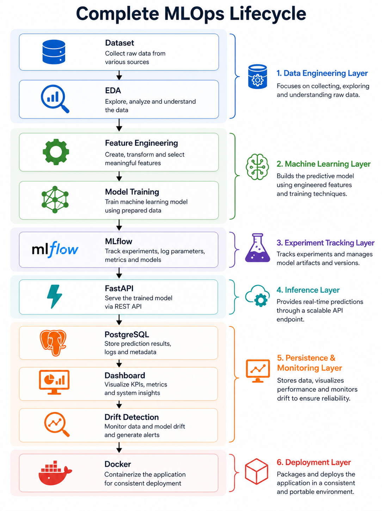

# Project Overview

**Document ID:** AFIP-001

**Project:** Adaptive Fraud Intelligence Platform

**Document Version:** 1.0

**Status:** Draft

---

# 1. Purpose

This document provides a high-level overview of the Adaptive Fraud Intelligence Platform, including its objectives, architecture, technology stack, major components, and end-to-end workflow. It serves as the entry point for understanding the overall system before exploring the detailed implementation presented in subsequent documents.

---

# 2. Background

Digital payment platforms and financial institutions process millions of transactions every day. Detecting fraudulent transactions accurately is essential because undetected fraud can result in significant financial losses, while excessive false positives negatively impact legitimate customers.

Traditional rule-based fraud detection systems require frequent manual updates and often fail to adapt to evolving fraud patterns. Machine learning offers a data-driven alternative by learning complex transaction behaviors from historical data and estimating the likelihood of fraudulent activity.

The Adaptive Fraud Intelligence Platform was developed to demonstrate how a production-oriented fraud detection system can be engineered by integrating machine learning, backend development, experiment tracking, data persistence, monitoring, containerization, and cloud deployment into a unified solution.

---

# 3. Solution Overview

The Adaptive Fraud Intelligence Platform is an end-to-end machine learning system designed to analyze financial transaction details and estimate the probability that a transaction is fraudulent.

Rather than allowing the machine learning model to make operational decisions directly, the predicted fraud probability is processed by a rule-based Decision Engine that converts the prediction into one of three business actions:

- **APPROVE** – Low fraud probability
- **VERIFY** – Medium fraud probability requiring additional verification (for example, OTP verification)
- **BLOCK** – High fraud probability

This separation between prediction and decision logic improves maintainability and allows business rules to evolve independently of the machine learning model.

---

# 4. System Architecture

The platform consists of six major subsystems.

The deployment strategy extends beyond containerization by incorporating an end-to-end MLOps workflow. This workflow connects data preparation, model development, deployment, monitoring, and continuous improvement into a unified lifecycle.



*Figure 6.2. End-to-end MLOps workflow.*

The workflow demonstrates how data, model training, deployment, monitoring, and feedback interact to support continuous model improvement and reliable production operations.

## 4.1 Data Engineering Layer

Responsible for preparing raw transaction data for model training.

Activities include:

- Data understanding
- Data preprocessing
- Feature engineering
- Dataset preparation

---

## 4.2 Machine Learning Layer

Responsible for training and evaluating fraud detection models.

Activities include:

- Model comparison
- Hyperparameter tuning
- Model evaluation
- Final CatBoost model selection

Multiple algorithms including Random Forest, XGBoost, and CatBoost were evaluated during experimentation. CatBoost was selected as the production model based on its overall performance.

---

## 4.3 Experiment Tracking Layer

MLflow is used to record:

- Model parameters
- Evaluation metrics
- Training artifacts
- Model versions

This enables reproducibility and systematic comparison of machine learning experiments.

---

## 4.4 Inference Layer

The inference service is implemented using FastAPI.

Incoming transaction records are:

1. Validated
2. Converted into model features
3. Passed to the trained CatBoost model
4. Assigned a fraud probability
5. Processed by the Decision Engine

The API returns a JSON response similar to:

```json
{
    "fraud_probability": 0.94,
    "decision": "BLOCK"
}
```

---

## 4.5 Persistence & Monitoring Layer

Every prediction request is logged into PostgreSQL.

The stored information is visualized through a Streamlit dashboard, which provides operational monitoring including:

- Total predictions
- Approved transactions
- Verified transactions
- Blocked transactions
- Average fraud probability
- Drift status
- Recent prediction history

This creates an audit trail for monitoring system behavior.

---

## 4.6 Deployment Layer

The inference service is containerized using Docker.

The Docker image contains:

- FastAPI application
- Trained CatBoost model
- Source code
- Python dependencies
- Configuration files

Containerization ensures consistent execution across different environments and prepares the application for cloud deployment.

---

# 5. High-Level Architecture

```
                     Training Pipeline
────────────────────────────────────────────────────────

Fraud Dataset
      │
      ▼
Data Preprocessing
      │
      ▼
Feature Engineering
      │
      ▼
Model Comparison
(Random Forest / XGBoost / CatBoost)
      │
      ▼
CatBoost Model
      │
      ▼
MLflow Tracking
      │
      ▼
Serialized Model

────────────────────────────────────────────────────────

                    Inference Pipeline

Client
      │
      ▼
FastAPI Service
      │
      ▼
Feature Preparation
      │
      ▼
CatBoost Model
      │
      ▼
Fraud Probability
      │
      ▼
Decision Engine
(APPROVE / VERIFY / BLOCK)
      │
      ▼
PostgreSQL
      │
      ▼
Streamlit Dashboard

────────────────────────────────────────────────────────

Deployment

Docker Container
      │
      ▼
AWS Cloud (Planned)
```

---

# 6. Technology Stack

| Component | Technology |
|------------|------------|
| Programming Language | Python |
| Machine Learning | CatBoost |
| API Framework | FastAPI |
| Database | PostgreSQL |
| Dashboard | Streamlit |
| Experiment Tracking | MLflow |
| Containerization | Docker |
| Version Control | Git & GitHub |
| Cloud Platform | AWS (Planned) |

---

# 7. End-to-End Workflow

The complete workflow of the platform is summarized below.

1. Raw transaction dataset is collected.
2. Data preprocessing and feature engineering are performed.
3. Multiple machine learning models are trained and evaluated.
4. MLflow records all experiments.
5. CatBoost is selected as the production model.
6. The trained model is packaged with the FastAPI application.
7. Docker creates a portable deployment image.
8. A client submits a transaction through the REST API.
9. FastAPI prepares the features and performs inference.
10. CatBoost predicts the fraud probability.
11. The Decision Engine converts the probability into a business decision.
12. Prediction results are stored in PostgreSQL.
13. The Streamlit dashboard visualizes system activity.
14. The complete platform is prepared for cloud deployment.

---

# 8. Current Project Status

| Component | Status |
|-----------|--------|
| Data Preprocessing | ✅ Completed |
| Feature Engineering | ✅ Completed |
| Model Comparison | ✅ Completed |
| CatBoost Training | ✅ Completed |
| MLflow Integration | ✅ Completed |
| FastAPI API | ✅ Completed |
| PostgreSQL Integration | ✅ Completed |
| Streamlit Dashboard | ✅ Completed |
| Docker Containerization | ✅ Completed |
| AWS Deployment | ⏳ In Progress |
| Explainable AI | 📌 Planned |
| Multi-Agent Extension | 📌 Planned |

---

# 9. Challenges

The primary challenge was engineering an end-to-end machine learning platform rather than developing an isolated predictive model.

Major engineering challenges included:

- Integrating multiple technologies into a unified architecture.
- Managing reproducible machine learning experiments.
- Designing a modular inference pipeline.
- Persisting prediction results for monitoring.
- Containerizing the application for deployment.
- Developing under limited local hardware resources.

---

# 10. Lessons Learned

This project demonstrated that successful machine learning systems require considerably more than model development.

Key learning outcomes include:

- End-to-end Machine Learning Engineering
- MLOps fundamentals
- REST API development
- Experiment tracking
- Database integration
- Containerized deployment
- Modular software architecture
- Production-oriented system design

---

# 11. Future Improvements

Planned enhancements include:

- AWS cloud deployment
- CI/CD pipeline
- Explainable AI using SHAP
- Automated model monitoring
- Advanced drift detection
- Intelligent fraud investigation workflows
- Multi-agent system integration

---

# 12. Interview Questions

1. Why was CatBoost selected over Random Forest and XGBoost?
2. Why is the Decision Engine separated from the machine learning model?
3. Why are prediction results stored in PostgreSQL?
4. Why was FastAPI chosen instead of Flask?
5. What role does MLflow play in the project?
6. Why was Docker used for deployment?
7. How would you scale this architecture for millions of transactions per day?