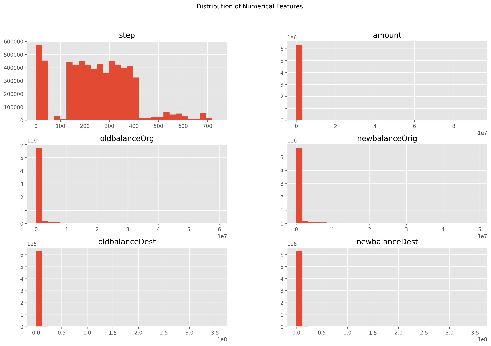
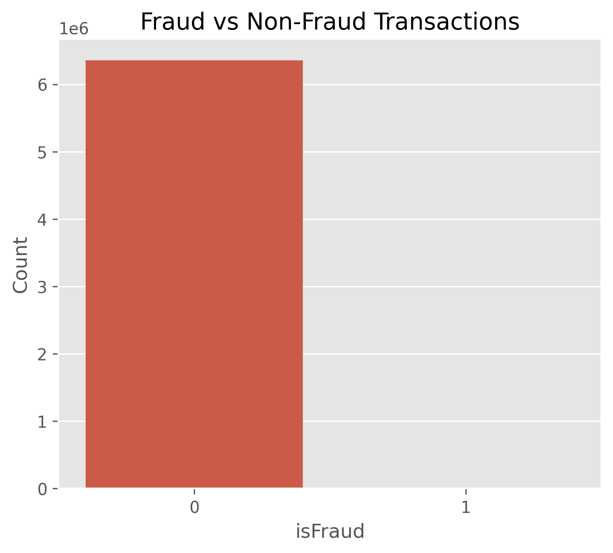
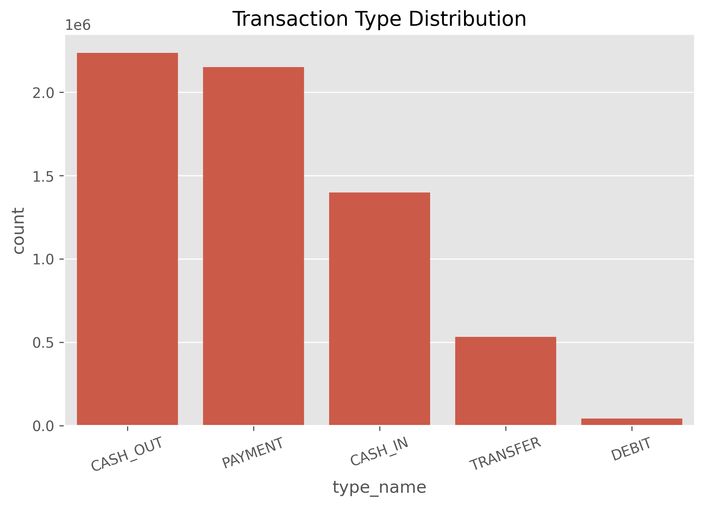
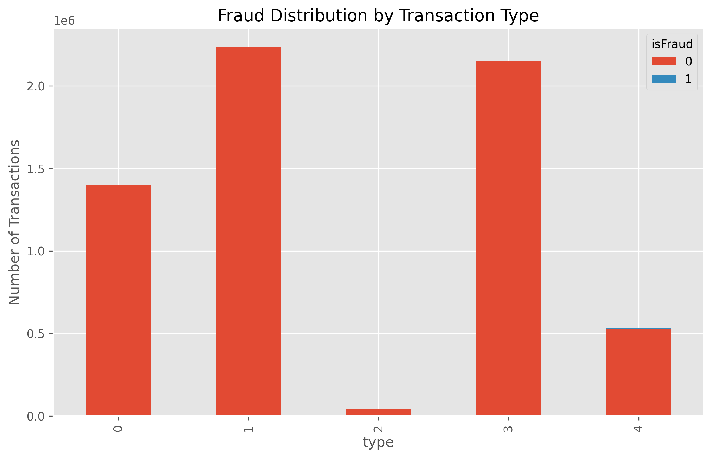
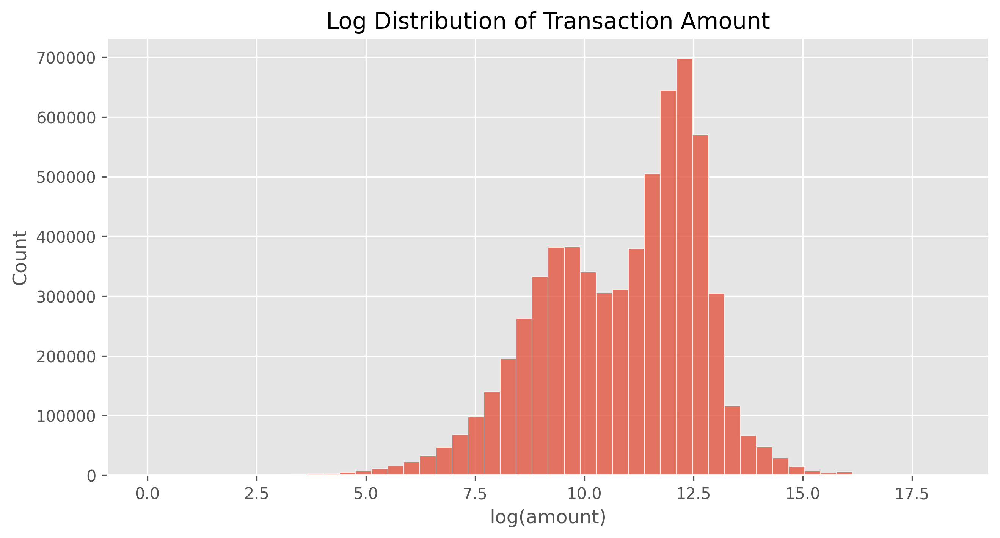
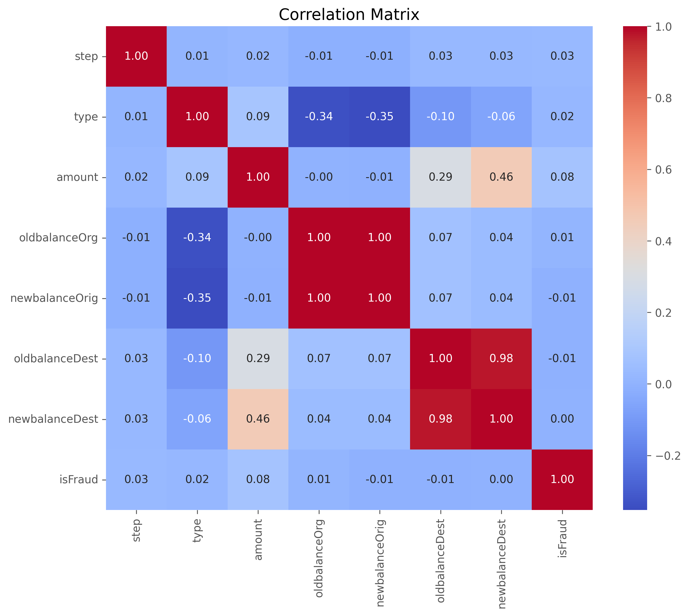

# Exploratory Data Analysis (EDA)

**Document ID:** AFIP-003

**Project:** Adaptive Fraud Intelligence Platform

**Document Version:** 1.0

**Status:** Draft

---

# 1. Purpose

This document presents the Exploratory Data Analysis (EDA) performed on the fraud detection dataset. The objective of the analysis is to understand the structure, quality, and characteristics of the dataset before feature engineering and model development.

The findings presented in this document guided several engineering decisions, including feature selection, handling class imbalance, categorical encoding, and machine learning model selection.

---

# 2. Background

Exploratory Data Analysis is a critical step in the machine learning lifecycle. Before building predictive models, it is essential to understand the underlying data distribution, identify quality issues, detect anomalies, and discover relationships between variables.

The analysis performed in this project focuses on understanding transaction behaviour rather than generating business reports.

---

# 3. Exploratory Data Analysis

## 3.1 Dataset Overview

The dataset contains approximately **6.36 million financial transaction records** with **11 features**, including one target variable (`isFraud`).

Each record represents a single financial transaction containing information such as transaction type, transaction amount, sender balance, receiver balance, and fraud status.

## 3.1 Dataset Overview



*Figure 3.1. Distribution of the numerical features before preprocessing.*

### Engineering Observation

- The dataset size is sufficiently large for training robust machine learning models.
- The available features represent transaction behaviour rather than customer demographics.

---

## 3.2 Missing Values and Duplicate Records

The dataset was inspected for missing values and duplicate records.

### Observations

- Only negligible missing values (single entries across several columns) were identified.
- No fully duplicated records were found.

### Engineering Decision

The overall data quality was considered high, allowing preprocessing to focus primarily on feature engineering rather than extensive data cleaning.

---

## 3.3 Class Distribution




*Figure 3.2. Distribution of fraudulent and legitimate transactions.*

The distribution of the target variable (`isFraud`) was analyzed to understand the balance between fraudulent and legitimate transactions.

### Observation

The dataset is **extremely imbalanced**.

| Class | Count |
|------:|------:|
| Non-Fraud | 6,354,407 |
| Fraud | 8,213 |

Fraudulent transactions represent only a very small percentage of the total dataset.

### Engineering Decision

Instead of oversampling or undersampling, the CatBoost classifier was configured with:

```python
auto_class_weights="Balanced"
```

This approach preserves the original transaction distribution while increasing the importance of minority-class samples during model training.

---

## 3.4 Transaction Type Analysis

| Index | Transaction Type | Encoded Value | Total Counts |
|------:|------------------|--------------:|-------------:|
| 0 | CASH_IN | 0 | 1,399,284 |
| 1 | CASH_OUT | 1 | 2,237,500 |
| 2 | DEBIT | 2 | 41,432 |
| 3 | PAYMENT | 3 | 2,151,495 |
| 4 | TRANSFER | 4 | 532,909 |



*Figure 3.3. Distribution of transaction categories.*

The distribution of transaction categories was analyzed.

The dataset contains the following transaction types:

- PAYMENT
- TRANSFER
- CASH_OUT
- DEBIT
- CASH_IN

### Observations

- PAYMENT transactions occur most frequently.
- Transaction categories are not uniformly distributed.
- Certain transaction types contribute disproportionately to fraudulent activity.

### Engineering Decision

Transaction type was retained as a predictive feature and encoded numerically before model training.

---

## 3.5 Fraud Distribution by Transaction Type

Fraud occurrences were analyzed across transaction categories.

| Encoded Value | Transaction Type | Non-Fraud (0) | Fraud (1) |
|--------------:|------------------|--------------:|----------:|
| 0 | CASH_IN | 1,399,284 | 0 |
| 1 | CASH_OUT | 2,233,384 | 4,116 |
| 2 | DEBIT | 41,432 | 0 |
| 3 | PAYMENT | 2,151,495 | 0 |
| 4 | TRANSFER | 528,812 | 4,097 |



*Figure 3.4. Fraud occurrence across different transaction types.*

### Observations

Fraudulent transactions are concentrated within specific transaction types rather than being evenly distributed across all categories.

This indicates that transaction type contains valuable predictive information.

### Engineering Decision

The transaction type feature was retained because it provides important contextual information that helps distinguish fraudulent behaviour.

---

## 3.6 Numerical Feature Distribution

The distributions of numerical variables were analyzed.


*Figure 3.5. Distribution of continuous numerical features.*

Features analyzed include:

- step
- amount
- oldbalanceOrg
- newbalanceOrig
- oldbalanceDest
- newbalanceDest

### Observations

- Most numerical features exhibit strong right-skewed distributions.
- A large proportion of transactions involve relatively small monetary values.
- Balance-related features contain many observations near zero.
- Several variables contain extreme outliers.

### Engineering Decision

Tree-based ensemble methods were preferred because they naturally handle skewed numerical distributions without requiring feature normalization.

---

## 3.7 Transaction Amount Analysis

The transaction amount feature was analyzed using both its original scale and a logarithmic transformation.



*Figure 3.6. Log-transformed distribution of transaction amounts.*

### Observations

- Transaction amounts are highly skewed.
- A small number of transactions involve exceptionally large monetary values.
- The logarithmic transformation reveals the underlying distribution more clearly.

### Engineering Decision

Although CatBoost does not require feature scaling, understanding the amount distribution was useful for interpreting transaction behaviour and identifying outliers.

---

## 3.8 Balance Feature Analysis

Sender and receiver balance features were examined.

### Observations

- Balance features contain highly skewed distributions.
- Many accounts have zero or very small balances.
- Account balances before and after transactions exhibit expected financial relationships.

### Engineering Decision

All balance-related variables were retained because they capture valuable financial behaviour associated with fraudulent transactions.

---

## 3.9 Correlation Analysis

Correlation analysis was performed on numerical variables.



*Figure 3.9. Pearson correlation matrix of the numerical features.*

### Observations

- Strong correlations exist between balance-related variables.
- No evidence suggested removing any features based solely on correlation.
- Multiple features contribute complementary information to fraud prediction.

### Engineering Decision

All numerical balance features were retained for model development.

---

# 4. Key Engineering Insights

The exploratory analysis provided several important insights that influenced the overall system design.

## Insight 1

Fraud detection is a highly imbalanced classification problem.

**Impact**

Class imbalance handling became a critical consideration during model development.

---

## Insight 2

Transaction type contains significant predictive information.

**Impact**

Transaction type was encoded and retained as a model feature.

---

## Insight 3

Identifier columns (`nameOrig` and `nameDest`) do not generalize well to unseen accounts.

**Impact**

These columns were excluded from model training and replaced by behavioural transaction features.

---

## Insight 4

Balance-related variables provide useful behavioural information.

**Impact**

These features were retained without removal.

---

## Insight 5

Fraud behaviour cannot be explained by a single feature.

**Impact**

A tree-based ensemble model (CatBoost) was selected because it can capture complex, nonlinear interactions among multiple variables.

---

# 5. Challenges

The following challenges were identified during exploratory analysis:

- Extreme class imbalance.
- Highly skewed numerical distributions.
- Presence of identifier columns unsuitable for prediction.
- Large dataset size requiring efficient visualization techniques.

---

# 6. Lessons Learned

The EDA demonstrated that understanding the data is equally important as selecting the machine learning algorithm.

Key lessons include:

- High-quality EDA improves feature engineering decisions.
- Real-world financial datasets rarely follow normal distributions.
- Fraud detection relies on behavioural patterns rather than isolated variables.
- Engineering decisions should be supported by exploratory evidence rather than assumptions.

---

# 7. Future Improvements

Future exploratory analyses may include:

- Time-series analysis of fraud trends.
- Customer transaction velocity analysis.
- Network analysis of sender and receiver accounts.
- Feature importance analysis using SHAP.
- Statistical hypothesis testing for feature significance.

---

# 8. Interview Questions

1. Why is Exploratory Data Analysis important before model development?
2. What challenges arise from highly imbalanced datasets?
3. Why were identifier columns excluded from the model?
4. Why was CatBoost selected after the exploratory analysis?
5. Which features appeared most informative during EDA?

---

# References

1. Fraud Detection Dataset – Kaggle

   https://www.kaggle.com/datasets/amanalisiddiqui/fraud-detection-dataset