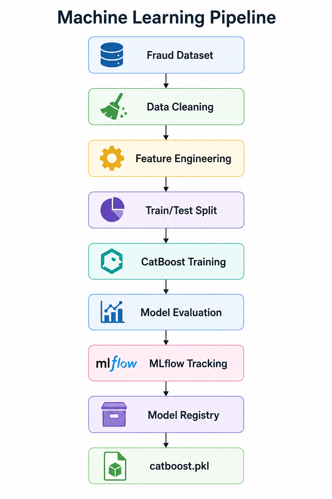

# Model Development

**Document ID:** AFIP-005

**Project:** Adaptive Fraud Intelligence Platform

**Document Version:** 1.0

**Status:** Draft

---

# 1. Purpose

This document describes the machine learning model development process for the Adaptive Fraud Intelligence Platform. It outlines the problem formulation, model selection strategy, experimentation, evaluation methodology, and engineering decisions that resulted in the final production model.


The objective was not merely to obtain the highest accuracy, but to develop a production-ready fraud detection model capable of identifying fraudulent transactions while minimizing financial risk.


---

# 2. Background

Fraud detection is a supervised binary classification problem in which each financial transaction must be classified as either legitimate or fraudulent.

Real-world fraud datasets present several challenges:

- Severe class imbalance
- High financial cost of missed fraud
- Complex nonlinear relationships between transaction features
- Requirement for real-time inference

These characteristics influenced both model selection and evaluation strategy. Consequently, traditional accuracy is not an appropriate performance metric.

The modelling strategy therefore emphasizes Precision, Recall, F1-score, ROC Curve, Precision–Recall Curve and SHAP explainability. CatBoost was selected as the final production model because of its superior performance, robustness and deployment readiness.

---

# 3. Problem Formulation

The Adaptive Fraud Intelligence Platform predicts whether an incoming financial transaction should be:


- APPROVE
- VERIFY
- BLOCK


The prediction is based on historical transaction behaviour learned during model training. Unlike traditional binary fraud classifiers, the production system converts model probabilities into operational decisions using predefined probability thresholds.

---

# 4. Data Preparation
Before model training, the dataset underwent the preprocessing and feature engineering pipeline documented in:


- DATASET.md
- EDA.md
- FEATURE_ENGINEERING.md


The prepared dataset included:


- Cleaned features
- Encoded transaction types
- Engineered behavioural features
- Balance difference features
- Transaction ratio features
- Full balance transfer indicator


The dataset was divided using a stratified train-test split:


```python
train_test_split(
    test_size=0.20,
    random_state=42,
    stratify=y
)
```


Stratified sampling preserved the original fraud distribution in both training and testing datasets.


---


# 5. Model Selection Strategy

| Model | Role |
|-------|------|
| Balanced Random Forest | Baseline |
| XGBoost | Benchmark |
| CatBoost | Final Production Model |

Tree-based algorithms were selected because they:


- Handle nonlinear relationships effectively.
- Require minimal feature scaling.
- Are robust to skewed numerical distributions.
- Perform well on structured financial transaction data.


CatBoost achieved the best balance between predictive performance and deployment readiness.

---

# 6. Machine Learning Pipeline





*Figure 4.1. End-to-end machine learning workflow used by the Adaptive Fraud Intelligence Platform.*


Pipeline:

1. Data Loading
2. Feature Engineering
3. Data Splitting
4. Model Training
5. Hyperparameter Tuning
6. Model Evaluation
7. Model Serialization
8. Deployment

---

# 7. Experimental Evolution


## Phase 1 – SMOTE-Based Experiments


Initial experiments addressed the severe class imbalance using the Synthetic Minority Oversampling Technique (SMOTE).


SMOTE generated synthetic fraud samples to balance the training data before model training.


The following models were evaluated:


- Balanced Random Forest
- XGBoost
- CatBoost


Although SMOTE improved minority-class learning, it substantially increased dataset size and memory consumption.


---


## Phase 2 – Production Optimization


After evaluating the experimental results, the preprocessing pipeline was simplified.


Instead of generating synthetic fraud samples, the production model adopted CatBoost's built-in class balancing capability:


```python
auto_class_weights="Balanced"
```


This approach provided several advantages:


- Reduced memory usage.
- Simpler preprocessing pipeline.
- Elimination of synthetic sample generation.
- Better suitability for production deployment.


This change represents an engineering optimization rather than a change in modelling objective.


---


# 8. Model Training


The final production model uses the CatBoost classifier.


## Hyperparameters


| Parameter | Value |
|-----------|-------|
| iterations | 200 |
| depth | 6 |
| learning_rate | 0.10 |
| random_seed | 42 |
| auto_class_weights | Balanced |


CatBoost was selected because it combines strong predictive performance with efficient handling of imbalanced datasets through native class weighting.


---

# 9. Model Evaluation


The production model was evaluated using:


- Precision
- Recall
- F1-score
- Confusion Matrix
- ROC Curve
- Precision–Recall Curve
- Feature Importance
- SHAP Explainability


These metrics provide a more meaningful assessment than accuracy alone for highly imbalanced classification problems.


## 9.1 Final Production Performance


| Metric | Value |
|--------|------:|
| Precision | **0.8947** |
| Recall | **0.9976** |
| F1-score | **0.9433** |


### 9.2 Confusion Matrix


| | Predicted Legitimate | Predicted Fraud |
|---|---:|---:|
| Actual Legitimate | 1,270,688 | 193 |
| Actual Fraud | 4 | 1,639 |


The model successfully detected **1,639 out of 1,643 fraudulent transactions**, missing only **4 fraudulent transactions** during evaluation.


---

## 9.3 Confusion Matrix


**Figure 4.2:** Confusion Matrix.

Observed:

- True Negatives ≈ 1.27M
- False Positives = 193
- False Negatives = 4
- True Positives = 1,639

The extremely low false negative count demonstrates exceptional fraud detection capability.

## 9.4 ROC Curve


The ROC curve remains close to the upper-left corner, indicating excellent discrimination between legitimate and fraudulent transactions.

## 9.5 Precision–Recall Curve


The Precision–Recall curve remains consistently high across almost the entire recall range, confirming excellent minority-class performance.

## 9.6 Feature Importance


The engineered feature **amount_balance_ratio** is the most influential predictor, followed by transaction type and transaction amount.

## 9.7 SHAP Explainability


SHAP confirms that engineered balance features dominate prediction behaviour while providing transparent explanations for model decisions.

## 9.8 Business Interpretation

The model combines high fraud detection performance with strong interpretability, making it suitable for deployment in financial fraud detection systems.

---

# 10. Experimental Model Comparison


During the experimentation phase, three ensemble models were compared.


| Model | F1 Score | Outcome |
|--------|---------:|---------|
| Balanced Random Forest | 0.0925 | Rejected |
| XGBoost (SMOTE) | 0.9884 | Candidate |
| CatBoost (SMOTE) | 0.9921 | Best Experimental Performance |
| CatBoost (Production) | 0.9521 | Selected for Deployment |


The experimental SMOTE results were used to compare model behaviour. The deployed production model replaced SMOTE with native class weighting to improve deployment efficiency while maintaining excellent fraud detection performance.


---

# 11. Business Interpretation


The primary objective of the platform is to minimize undetected fraudulent transactions.


The production model achieves an exceptionally high recall of **99.76%**, indicating that nearly all fraudulent transactions are successfully identified.


Although a small number of legitimate transactions may be flagged for verification, this trade-off is acceptable because the financial impact of missing fraudulent activity is significantly greater than temporarily challenging a genuine customer.


This behaviour aligns directly with the project's design objectives.


---


# 12. Engineering Decisions


Several engineering decisions influenced the final model.


## Decision 1


Tree-based ensemble models were selected because they naturally capture nonlinear transaction behaviour.


---


## Decision 2


CatBoost replaced SMOTE through native class weighting, reducing preprocessing complexity and memory requirements.


---


## Decision 3


Feature scaling was omitted because CatBoost does not require normalized numerical inputs.


---


## Decision 4


The trained model was exported using Joblib after experiment tracking and model registration, allowing the inference service to remain independent of the MLflow server.


---


# 13. Challenges


The primary challenges encountered during model development included:


- Severe class imbalance.
- Selecting evaluation metrics beyond accuracy.
- Balancing recall and precision.
- Designing a production-friendly preprocessing pipeline.


---


# 14. Lessons Learned


Several important lessons emerged during model development.


- High accuracy alone is not an appropriate metric for fraud detection.
- Engineering decisions often have greater production impact than marginal improvements in model accuracy.
- Native class weighting can simplify deployment compared to synthetic oversampling.
- Model evaluation should always be interpreted within the context of business objectives.


---


# 15. Future Improvements


Future versions of the platform may include:


- Hyperparameter optimization using Optuna.
- Automated model selection.
- Probability calibration.
- Ensemble stacking.
- Automated model promotion through the MLflow Model Registry.
- Online learning for adaptive fraud detection.


---


# 16. Interview Questions


1. Why is fraud detection considered an imbalanced classification problem?
2. Why was F1-score preferred over accuracy?
3. Why was CatBoost selected instead of Random Forest or XGBoost?
4. Why was SMOTE replaced by `auto_class_weights="Balanced"`?
5. Why is recall particularly important in fraud detection?
6. Why did you export the production model instead of loading directly from MLflow?


---


# References


1. CatBoost Documentation
2. MLflow Documentation
3. Kaggle – Fraud Detection Dataset

