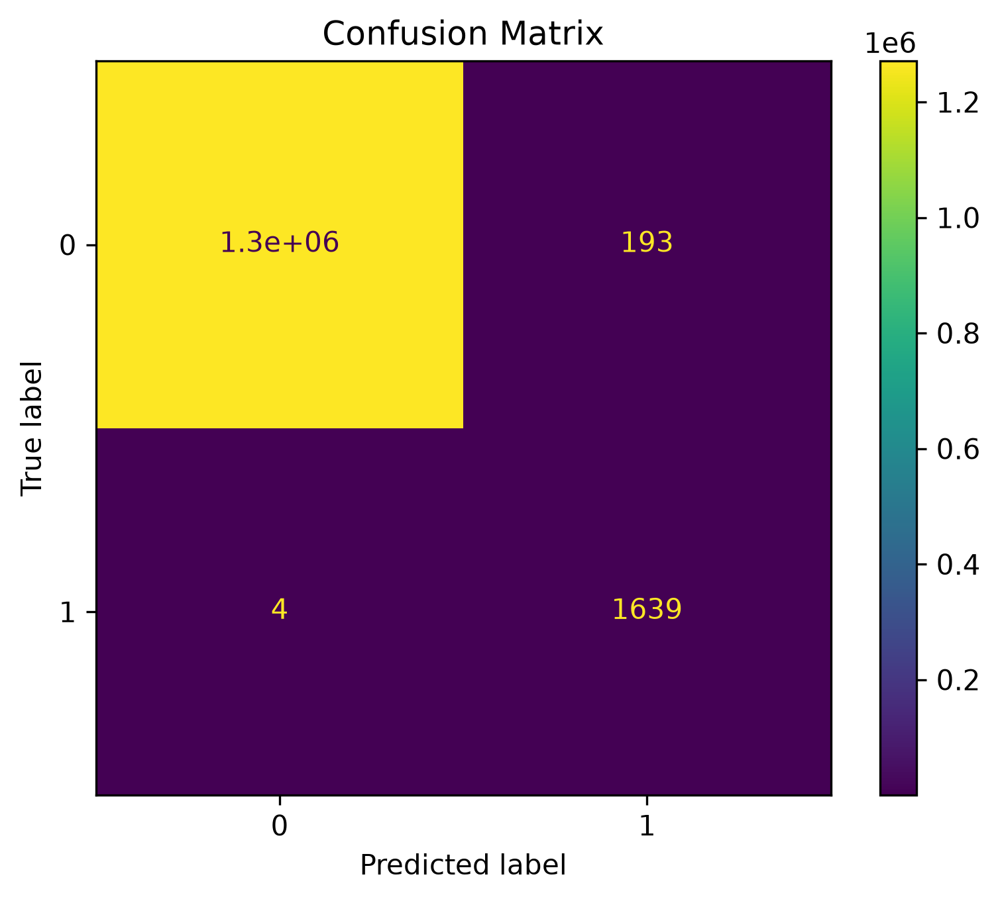
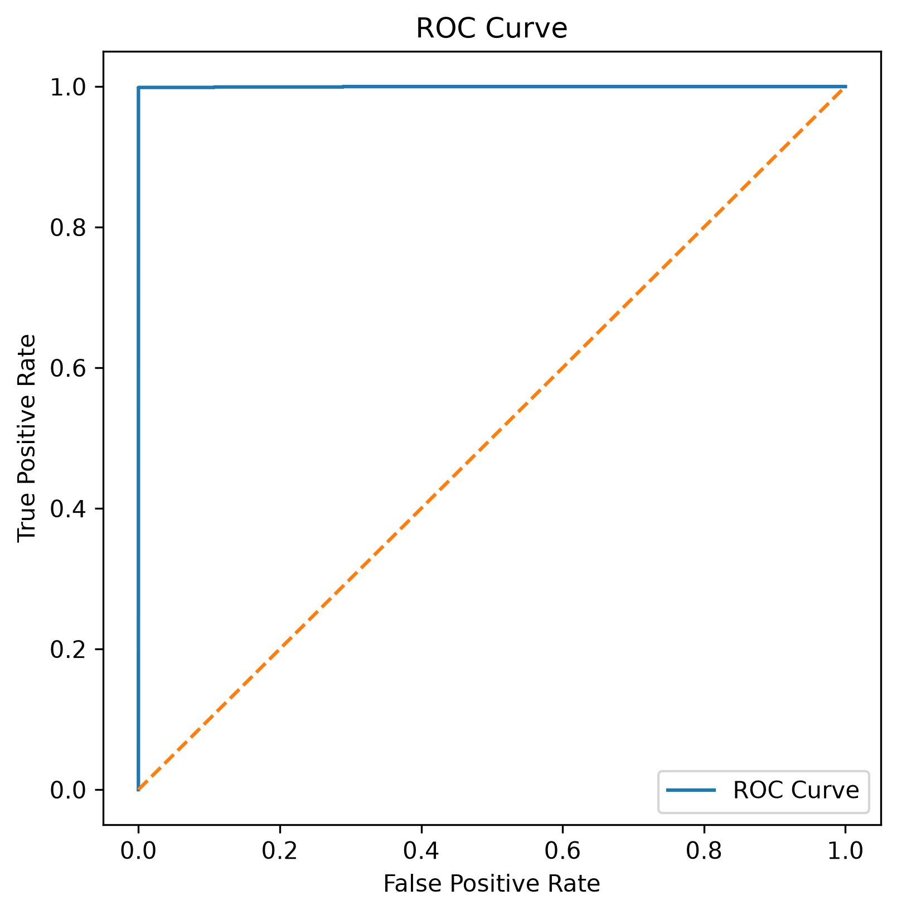
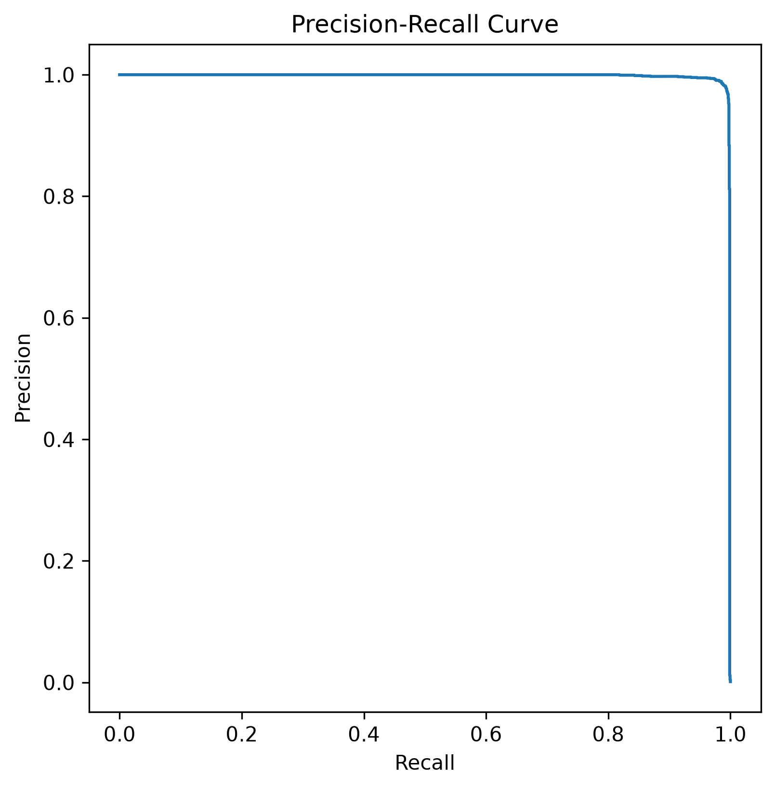
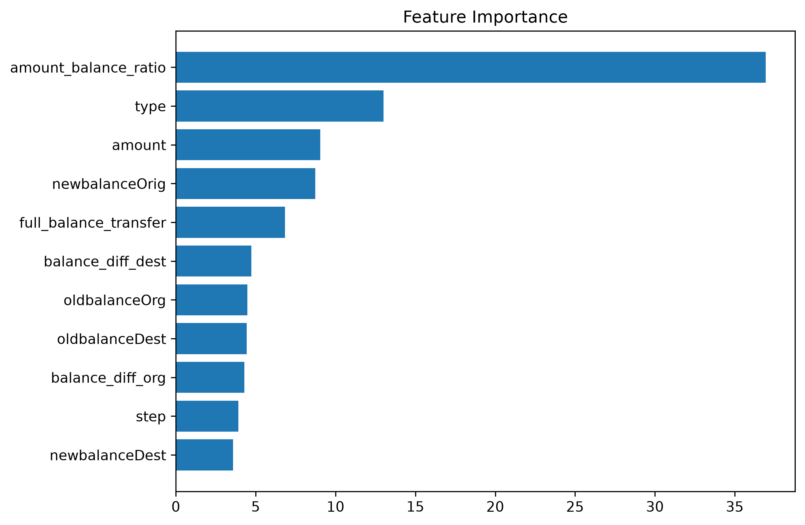
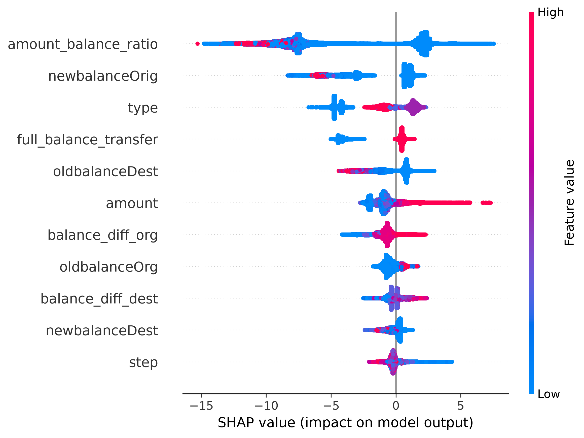

# Model Development

**Document ID:** AFIP-005

**Project:** Adaptive Fraud Intelligence Platform

**Document Version:** 1.0

**Status:** Draft

---

# 1. Purpose

This document describes the end-to-end development of the fraud detection model used in the Adaptive Fraud Intelligence Platform. It covers data preparation, feature engineering, model selection, training, evaluation, explainability, and comparative experimentation.

The objective is to build a highly reliable fraud detection model capable of identifying fraudulent financial transactions while maintaining an extremely low false negative rate and a low false positive rate suitable for real-world financial systems.

---

# 2. Background

Financial fraud detection is a highly imbalanced binary classification problem where fraudulent transactions account for only a tiny fraction of the overall dataset. Consequently, traditional accuracy is not an appropriate performance metric.

The modelling strategy therefore emphasizes Precision, Recall, F1-score, ROC Curve, Precision–Recall Curve and SHAP explainability. CatBoost was selected as the final production model because of its superior performance, robustness and deployment readiness.

---

# 3. Problem Formulation

The model predicts whether a financial transaction is fraudulent. Within the deployed application, prediction probabilities are converted into three operational decisions:

- Approve
- Verify
- Block

---

# 4. Data Preparation

The dataset underwent preprocessing, feature engineering, categorical encoding and stratified train-test splitting before model training.

```python
train_test_split(
    test_size=0.20,
    random_state=42,
    stratify=y
)
```

---

# 5. Model Selection Strategy

| Model | Role |
|-------|------|
| Balanced Random Forest | Baseline |
| XGBoost | Benchmark |
| CatBoost | Final Production Model |

CatBoost achieved the best balance between predictive performance and deployment readiness.

---

# 6. Machine Learning Pipeline


**Figure 4.1:** End-to-end machine learning workflow.

Pipeline:

1. Data Loading
2. Feature Engineering
3. Data Splitting
4. Model Training
5. Hyperparameter Tuning
6. Model Evaluation
7. Model Serialization
8. Deployment

---

# 7. Model Training

The production model uses **CatBoostClassifier**.

| Hyperparameter | Value |
|---|---|
| iterations | 500 |
| depth | 8 |
| learning_rate | 0.1 |
| loss_function | Logloss |
| eval_metric | F1 |
| random_seed | 42 |

---

# 8. Model Evaluation

## 8.1 Evaluation Strategy

Evaluation was performed using Precision, Recall, F1-score, Confusion Matrix, ROC Curve, Precision–Recall Curve, Feature Importance and SHAP Explainability.

## 8.2 Final Production Performance

| Metric | Value |
|---|---:|
| Precision | **0.89** |
| Recall | **1.00** |
| F1-score | **0.94** |

## 8.3 Confusion Matrix



**Figure 4.2:** Confusion Matrix.

Observed:

- True Negatives ≈ 1.27M
- False Positives = 193
- False Negatives = 4
- True Positives = 1,639

The extremely low false negative count demonstrates exceptional fraud detection capability.

## 8.4 ROC Curve



The ROC curve remains close to the upper-left corner, indicating excellent discrimination between legitimate and fraudulent transactions.

## 8.5 Precision–Recall Curve



The Precision–Recall curve remains consistently high across almost the entire recall range, confirming excellent minority-class performance.

## 8.6 Feature Importance



The engineered feature **amount_balance_ratio** is the most influential predictor, followed by transaction type and transaction amount.

## 8.7 SHAP Explainability



SHAP confirms that engineered balance features dominate prediction behaviour while providing transparent explanations for model decisions.

## 8.8 Business Interpretation

The model combines high fraud detection performance with strong interpretability, making it suitable for deployment in financial fraud detection systems.

---

# 9. Experimental Comparison

| Model | Precision | Recall | F1-score |
|---|---:|---:|---:|
| Balanced Random Forest | — | — | — |
| XGBoost | — | — | — |
| **CatBoost** | **0.89** | **1.00** | **0.94** |

CatBoost was selected as the final production model.

---

# Conclusion

The Adaptive Fraud Intelligence Platform demonstrates a complete production-ready machine learning workflow incorporating robust feature engineering, ensemble learning, comprehensive evaluation and explainable AI.