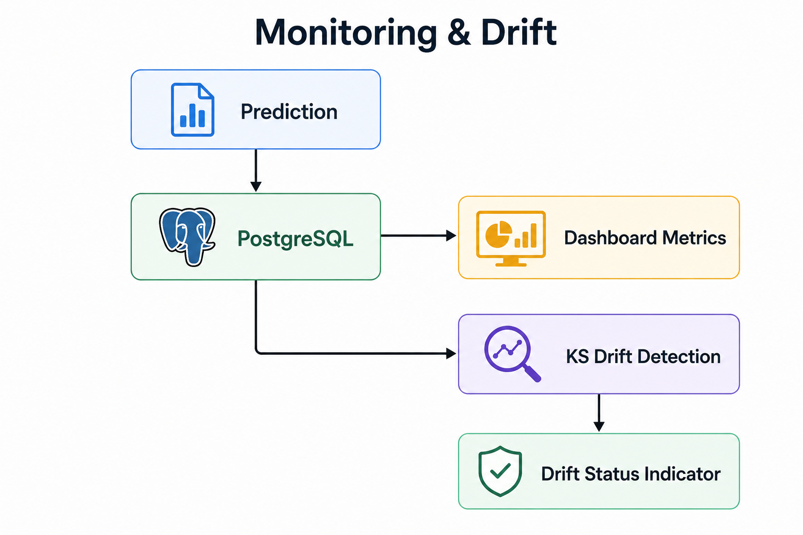
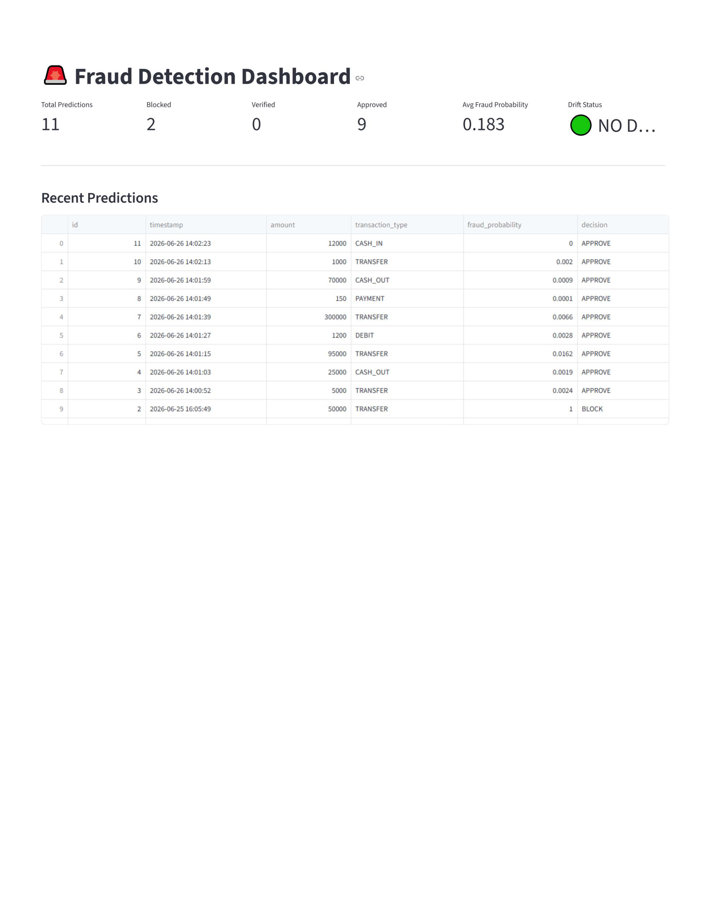

# Monitoring Dashboard

**Document ID:** AFIP-010

**Project:** Adaptive Fraud Intelligence Platform

**Module:** Monitoring

**Document Version:** 1.0

**Status:** Final

---

# 1. Purpose

Deploying a machine learning model is only one stage of the production lifecycle. Once deployed, the model must be continuously monitored to understand its operational behavior and prediction trends.

The Adaptive Fraud Intelligence Platform includes a monitoring dashboard developed using Streamlit. The dashboard provides real-time visibility into prediction activity, fraud decisions, and model behavior by retrieving production inference data from PostgreSQL.

This document describes the dashboard architecture, implementation, monitored metrics, and integration with the overall platform.

---

# 2. Why Monitoring?

A production machine learning system should answer questions such as:

- How many predictions have been processed?
- How many transactions were blocked?
- How many transactions require verification?
- What is the average fraud probability?
- Is the production data showing signs of drift?

Without monitoring, it becomes difficult to understand how the deployed model behaves after deployment.

The monitoring dashboard addresses these requirements by presenting operational metrics in a simple visual interface.

---

# 3. Dashboard Architecture

The monitoring framework continuously evaluates both incoming transaction data and model performance to detect changes that could reduce prediction quality. This enables timely intervention through alerts and model retraining when necessary.



*Figure 7.1. Monitoring and drift detection workflow.*

The monitoring pipeline tracks data quality, feature distributions, prediction behavior, and performance metrics to identify data drift, concept drift, and model degradation.
# 4. Technology Stack
A web-based user interface was developed using Streamlit to demonstrate the fraud detection workflow. Users can input transaction details and receive real-time fraud predictions generated by the deployed CatBoost model.

The dashboard displays the predicted fraud probability together with the corresponding operational decision (Approve, Verify, or Block), providing an intuitive interface for interacting with the prediction system.
The monitoring dashboard was implemented using **Streamlit**.

Streamlit was selected because it provides:

- Lightweight web application development.
- Native support for data visualization.
- Easy integration with Pandas.
- Simple deployment during development.
- Rapid dashboard development.



**Figure 4.1:** Streamlit dashboard used for real-time fraud prediction and decision support.

---

# 5. Dashboard Workflow

The monitoring process follows the workflow below.

```
PostgreSQL
      │
      ▼
Read Prediction History
      │
      ▼
Compute Dashboard Metrics
      │
      ▼
Retrieve Recent Predictions
      │
      ▼
Display Streamlit Dashboard
```

The dashboard retrieves production data whenever the application is refreshed.

---

# 6. Dashboard Metrics

The dashboard displays six key operational metrics.

| Metric | Description |
|---------|-------------|
| Total Predictions | Total number of predictions stored in PostgreSQL |
| Blocked | Number of transactions classified as BLOCK |
| Verified | Number of transactions classified as VERIFY |
| Approved | Number of transactions classified as APPROVE |
| Average Fraud Probability | Mean fraud probability across all predictions |
| Drift Status | Current data drift status reported by the monitoring module |

These metrics provide a quick overview of system behavior.

---

# 7. Recent Predictions

The dashboard displays a table containing the latest prediction records.

The records are retrieved using:

```
SELECT *
FROM predictions
ORDER BY timestamp DESC
```

The table provides visibility into:

- Prediction timestamp
- Transaction amount
- Transaction type
- Fraud probability
- Final decision

Displaying recent prediction history enables rapid inspection of production activity.

---

# 8. Dashboard Refresh

The current implementation updates the dashboard whenever the page is manually refreshed.

Each refresh executes fresh database queries and displays the latest prediction information.

Automatic refresh has not been implemented in the current version.

---

# 9. PostgreSQL Integration

The dashboard obtains all information directly from PostgreSQL.

Two database queries are performed.

## Query 1

Retrieve recent predictions.

```
PostgreSQL

↓

Prediction History
```

---

## Query 2

Compute dashboard statistics.

```
Prediction History

↓

Total Predictions

Blocked

Verified

Approved

Average Probability
```

This design avoids storing duplicate monitoring data.

---

# 10. Drift Status Integration

The dashboard integrates with the drift detection module.

```
Drift Detection Module
        │
        ▼
Current Drift Status
        │
        ▼
Dashboard Indicator
```

The dashboard displays one of the following values:

- 🟢 NO DRIFT
- 🔴 DRIFT DETECTED
- 🟡 NOT ENOUGH DATA

This allows operators to monitor production data quality directly from the dashboard.

---

# 11. Engineering Decisions

Several engineering decisions influenced the monitoring design.

### Decision 1

The dashboard retrieves data directly from PostgreSQL rather than maintaining a separate monitoring database.

---

### Decision 2

Operational metrics are computed dynamically rather than permanently stored.

---

### Decision 3

The dashboard performs only read operations, ensuring that monitoring does not affect production inference.

---

### Decision 4

Manual page refresh was selected for the initial implementation to keep the monitoring system lightweight and simple.

---

# 12. Challenges

The primary challenges encountered during implementation included:

- Designing meaningful operational metrics.
- Integrating Streamlit with PostgreSQL.
- Presenting production information in a compact dashboard.
- Integrating drift detection with monitoring.

---

# 13. Lessons Learned

Developing the monitoring dashboard reinforced several software engineering concepts.

- Machine learning systems require operational monitoring.
- Production databases can serve multiple system components.
- Lightweight dashboards provide valuable operational insight.
- Monitoring should remain independent from prediction logic.

---

# 14. Future Improvements

Future versions of the dashboard may include:

- Automatic refresh.
- Interactive filtering.
- Historical trend charts.
- Fraud probability distribution plots.
- Daily prediction summaries.
- User authentication.
- Export functionality.

---

# 15. Interview Questions

1. Why was Streamlit selected?
2. Why are dashboard metrics computed dynamically?
3. Why does the dashboard read directly from PostgreSQL?
4. Why is manual refresh used?
5. What operational metrics are displayed?
6. How does the dashboard obtain drift status?
7. Why should monitoring remain separate from inference?

---

# References

1. Streamlit Documentation
2. PostgreSQL Documentation
3. Adaptive Fraud Intelligence Platform Source Code