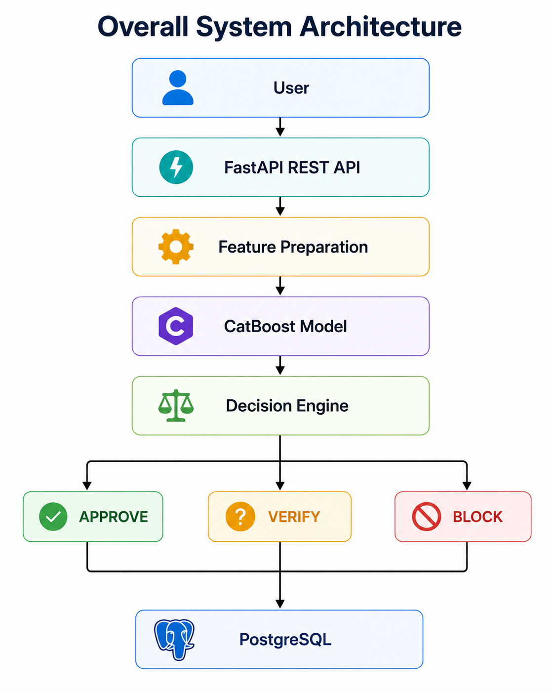

# Adaptive Fraud Intelligence Platform

> **Version 1.0** • Production-Inspired Machine Learning System

**An end-to-end machine learning platform for fraud detection, built with production-inspired MLOps practices using FastAPI, Docker, MLflow, and modern Machine Learning Engineering practices.**

This documentation describes the architecture, implementation, deployment, monitoring, and engineering decisions behind the Adaptive Fraud Intelligence Platform.

## System Architecture



---

## Project Overview

The Adaptive Fraud Intelligence Platform demonstrates how a fraud detection solution can be designed using modern Machine Learning Engineering principles rather than focusing solely on model development.

The platform combines:

- Machine Learning
- FastAPI REST APIs
- MLflow Experiment Tracking
- Docker Containerization
- Monitoring & Drift Detection
- Engineering Documentation
- Modular Architecture

to simulate a production-inspired fraud detection system.

---

## Platform Capabilities

!!! success "Core Features"

    - End-to-End Machine Learning Workflow
    - Production-Inspired Architecture
    - FastAPI REST API
    - Dockerized Deployment
    - MLflow Experiment Tracking
    - Model Registry Integration
    - Monitoring & Drift Detection
    - Engineering Documentation
    - Modular Project Design

---

## Technology Stack

| Layer | Technology |
|--------|------------|
| Programming | Python |
| Machine Learning | Scikit-learn, XGBoost |
| Backend API | FastAPI |
| Experiment Tracking | MLflow |
| Containerization | Docker |
| Documentation | MkDocs Material |
| Version Control | Git & GitHub |

---

## Documentation Overview

This documentation is organized into the following sections.

### Foundation

Project vision, scope, charter and documentation standards.

### Data

Dataset understanding, exploratory data analysis and feature engineering.

### Machine Learning

Model development, training pipeline and experiment tracking.

### Backend

REST API implementation using FastAPI and PostgreSQL integration.

### Deployment

Docker architecture and deployment strategy.

### Monitoring

Dashboard design and concept drift detection.

### Project Management

Engineering decisions, project challenges and lessons learned.

### Future Roadmap

Future enhancements including Agentic AI capabilities.

---

## Project Objectives

The primary objectives of this project are to:

- Design an end-to-end fraud detection platform
- Apply production-inspired MLOps practices
- Build reproducible ML pipelines
- Track experiments using MLflow
- Deploy models through REST APIs
- Containerize applications using Docker
- Produce professional engineering documentation

---

## Repository Structure

```text
docs/
├── Foundation
├── Data
├── Machine Learning
├── Backend
├── Deployment
├── Monitoring
├── Project Management
└── Future
```

---

## About This Documentation

This documentation serves as the engineering reference for the **Adaptive Fraud Intelligence Platform**, covering system design, implementation details, deployment strategy, monitoring concepts, and future enhancements.